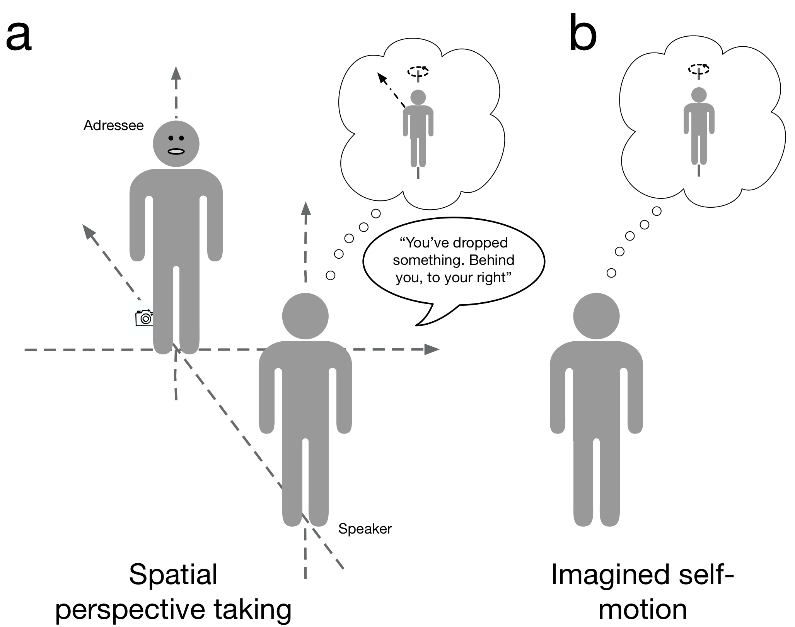
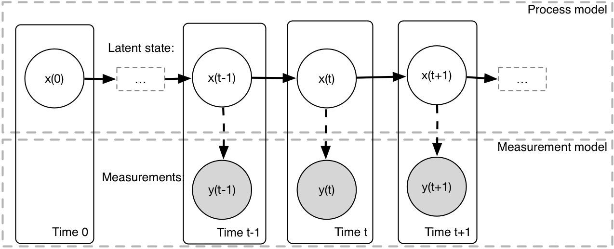
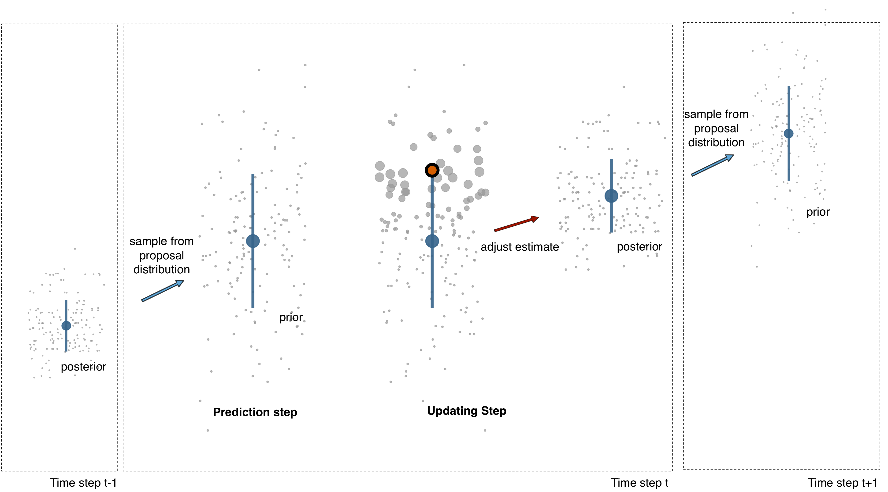
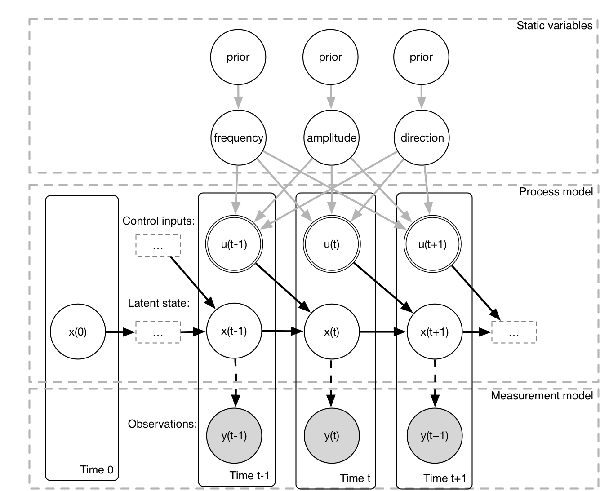

```{r preliminary, message=FALSE, warning=FALSE, cache=FALSE, include=FALSE}
library(papaja)
# library(pander)
library(ggplot2)
library(dplyr)
library(tidyr)
library(mvtnorm)
# library(ggthemes)
library(cowplot)

source('~/thesis/papers/pgm-spt/R/utils.R')
source('~/thesis/papers/pgm-spt/R/2d-particle-filter.R')
source('~/thesis/papers/pgm-spt/simulations/rbiips-model.R')

knitr::opts_chunk$set(cache = TRUE,
                      fig.width = 12, fig.height = 8,
                      dpi = 600, fig.path = "generated-figures/",
                      dev=c('pdf', 'png', 'tiff', 'cairo_ps'))
```


# Introduction
 <!-- convey how the work constraints current theorizing over and above the current literature -->
 
<!-- The aim of this paper is to describe potential contributions of the vestibular system to spatial perspective transformations in the context. of probabilistic sensory inference. -->

<!-- The goal of this study is to discuss the role of the vestibular system in embodied mental transformations. -->

Adopting the spatial perspective of another person is an essential cognitive ability, and plays a vital role in our ability to determine possible actions of another person, and in order to coordinate joint actions [@CreemRegehr:2013kx, @Pezzulo:2013iy]. Perspective taking is also considered to be of fundamental importance for language comprehension and communication [@Beveridge:2013gx], and social cognition in general [@Deroualle:2014ho].  
<!-- [ok] -->
A number of recent studies have demonstrated that the vestibular system, which processes sensory signal relating to angular and linear movements of the head, is involved in such spatial transformations [@Lenggenhager:2008et, @Deroualle:2015gk, @Falconer:2012cl, @Gardner:2016kd]. This is demonstrated in the form of interference effects between mental transformations and concurrent sensory stimulation. To date, however, there has little attempt to understand the involvement of the vestibular system in higher-level cognitive abilities in terms of the computational mechanisms.
<!-- [ok] -->
Consider the use of deictic pronouns, such as "this" or "that" and "left" or "right". These terms only assume a meaning relative to a certain frame of reference (FOR). For example, in a dialogue between two speakers, the statement "I would like that one", or "I would like the one on the right" can only be understood if both interlocutors are able to access the other's FOR with respect to an external FOR. A further example that requires a similar spatial transformation is when two people want to perform a coordinated action, such as lifting a heavy object. This requires having knowledge of the other's potential actions in order to adjust one's own actions, and this again requires knowledge of the other's position within an external FOR. A judgement about what kind of actions the other person can perform requires an embodied simulation using a representation of one's own body schema [@Pezzulo:2013iy] and giving an instruction to another person thus requires running an embodied simulation in order to infer what kind of motor commands the other person should perform __[Blakemore and Decety, 2001; Wolpert et al., 2003; Jeannerod, 2006; Pezzulo et al., 2007, 2013; Dindo et al., 2011; Pezzulo, 2011a,b]__. But this again requires information about the addressee's FOR relative to the external reference frame, and the difference between the speaker and the addressee's egocentric reference frames. Perspective taking can be conceived of as a aligning a representation of one's body with that of another person in order to access spatial information from a viewpoint other than one's own egocentric viewpoint. In order to achieve this alignment, one must perform translations and rotations of one's own egocentric reference frame. Processing translations and rotations of the head and body is the core domain of the vestibular system, and thus is of particular interest for research into mental spatial transformations. 
<!-- [ok] -->
Spatial transformations in 6 dimensions (translation along 3 axes, and rotations around 3 axes) are highly complex, and non-linear, and it has been proposed that the brain adopts the strategy of simulating motion of the body through space in order achieve a desired target position [CITATION]. This effectively amounts to a running a simulation of dynamical system, consisting of simulated limb movements and the resulting sensory consequences. Figure \@ref(fig:spt-schematic) (a) shows a simple scenario in which a speaker wants to tell an addressee, standing opposite, to pick something up from the floor. The speaker must determine the most suitable action by embodied simulation, given the addressee's position relative to the external object, and in order to achieve this goal, the speaker must align himself with the addressee, so that he can use his own body-centred FOR. In this example, alignment with the addressee's reference frame consists of a forwards translation and a rotation around the vertical axis. This can be described as an imagined movement, in which the goal is achieve a specific position. 

<!-- ![Perspective taking and imagined self-motion involve spatial transformations of a representation of the self. (a) If a speaker's goal is to take the perspective of an addressee, he must first solve the inverse problem of determining the appropriate action, and then run a forwards simulation in order to perform a translation and rotation of his own egocentric reference frame. These operations can be viewed as imagined movements.(b) Focussing on imagined rotation around the vertical axis allows us to simplify the problem, and highlights the fact that perspective taking and mental imagery involve common computations.](diagrams/fig-1-common-process.tiff){#fig:spt-schematic width=75%} -->


```{r spt-schematic, fig.cap="Perspective taking and imagined self-motion involve spatial transformations of a representation of the self. (a) If a speaker's goal is to take the perspective of an addressee, he must first solve the inverse problem of determining the appropriate action, and then run a forwards simulation in order to perform a translation and rotation of his own egocentric reference frame. These operations can be viewed as imagined movements.(b) Focussing on imagined rotation around the vertical axis allows us to simplify the problem, and highlights the fact that perspective taking and mental imagery involve common computations.", echo=FALSE}

```

In order to do this, the speaker must first determine what type of movement to perform. This means that in order to know what to simulate, the speaker must first work backwards from the desired outcome, and infer the actions that are most likely to lead to that outcome [@Hamrick:2014wq]. In the field of motor control, this is known as the inverse problem [@Wolpert:1998td]. In order to achieve the desired position, the motor commands can then be simulated, and the expected sensory consequences can be estimated; this is known as the forward problem. 
Figure \@ref(fig:spt-schematic) (b) shows that if the goal is to deliberatively simulate the perceptual experience of rotation around the body's vertical (yaw) axis, rather than project a representation of one's body onto a target, the problem is simplified; the actor can perform forward inference without the need to determine the optimal motor action. 
As demonstrated by @Penny:2013iv, these computations can be performed in a common probabilistic model. Interestingly, this has been discussed in the context of reinforcement learning, and planning in humans has been described as reverse inference [@Botvinick:2012fe]. Further, [@Pickering:2014bo] discuss the relationship between control-theoretic notions of inverse/forward models, known collectively as internal models, and and more general concepts of a generative model in a hierarchical Bayesian framework.
<!-- [ok] -->
Simulating the behaviour of a dynamical system using a forward model requires a generative model of the system. 

The aim of this paper is to specifically investigate the generative model that may be used for mental spatial transformations. The ability to run embodied simulations is often claimed to be grounded in the relevant sensorimotor circuits, and we claim that the vestibular system is ideally suited to investigate this connection, because the generative models used by the vestibular system for dynamic sensory inference have been extensively investigated using approaches from optimal control theory, and more recently, dynamic Bayesian inference [Oman, CITATIONS, @PaulRMacNeilage:2008bv]. 

The vestibular system faces a number of challenges in interpreting the sensory measurements provided by the semi-circular canals (SCC) and otolith organs. On the one hand, these signals  are very noisy, and ambiguous; the otoliths respond both to translations and tilt of the head relative to gravity, and in order to disambiguate between translation and tilt, the brain must perform sophisticated computations. The emerging picture is that the nature of these computations is probabilistic, and that the brain makes use of strong prior beliefs in order to interpret these sensory signals [Mittelstaedt, etc]. A further challenge faced by the vestibular system is that it needs to distinguish between sensory signals that are the result of active motion, and those resulting from external forces [@Cullen:2009dc, @Cullen:2014gx]. The ability to distinguishing re-afferent from ex-afferent sensory signals is an essential capability of all organisms that move actively [@Crapse:2008jc].

Furthermore, the apparent connection between mental imagery and predictive processing has repeatedly been alluded to [@Moulton:2009ij, @Clark:2012vf, @Gambi:2015gv], and @Grush:2004wx claims that mental imagery is performed by emulator circuits implementing a forward model. These ideas can also be addressed from a computational point of view in the context of dynamic Bayesian inference, where there are multiple roles for sensory predictions, over different time scales. This was recently discussed by [@Tian:2012ui] in the context of imagined speech. 
<!-- [ok] -->
The putative link between predictive processing and higher cognitive processing has a firm basis in predictive processing accounts of sensory inference [Friston]. The predictive processing framework has been applied to almost all sensory modalities [CITATIONS: pain, proprioception, auditory , visual, etc.], and the picture that has emerged in recent years is that the brain employs sophisticated inference algorithms in order to "interpret" the stream of incoming sensory data. The brain seems to be actively engaged in formulating hypotheses, and testing these on sensory data; this has been extended to the concept of active inference [Friston], in which an agent attempts to either change it's internal model of world, or to intervene on the world in order to fulfill sensory predictions. 

We claim that the vestibular modality is particularly well-suited to investigating predictive processing at multiple hierarchical scales, from the lowest levels of sensory inference to higher levels, where goals, intentions and beliefs of the organism become relevant. A case in point is the study by @Wertheim:2001cb, who provided evidence that participants' perceptions of tilt induced by vestibular stimulation are shaped to a large extent by the beliefs about possible motions they formed prior to taking part in the experiment.
<!-- [ok] -->

Interference effects between higher-level cognitive processes, such as SPT and mental imagery, and sensory inference, are thought to occur as a result of shared circuitry [@Deroualle:2014ho, @Nigmatullina:2015gh]. However, the precise nature of such interactions, and what exactly might be shared, is left unspecified. At first glance, it appear unlikely that such interference should be possible, as low levels of vestibular processing appear to be cognitively impenetrable [CITATION]. In particular, @Nigmatullina:2015gh found that the onset of the vestibulo-ocular reflex (VOR) was earlier when the direction of an imagined self-rotation was congruent with the direction of a subsequently experienced rotation. The VOR, however, must be susceptible to the influence of intentions and goals; for example, if a person intends to fixate a target during a movement, the VOR should be cancelled. Thus, seemingly reflexive, and impenetrable, motor actions require a large amount of flexibility based on top-down information. Even accepting the fact that low level sensorimotor processing may be more cognitively penetrable than previously thought, the fact that imagining a rotation of the self should have an effect on a person's ability to detect rotations, or to discriminate between directions of rotation, still requires an explanation.

> NOTE: we need to include all studies demonstrating interference, especially in the direction cognition -> inference (Nigmatullina effect)

@Ellis:2017fg recently claimed that the types of interference effects might arise as a result of cognitive processing exerting an influence on circuits performing sensory inference via shared higher-level priors. In particular, the interference described by @Nigmatullina:2015gh looks like an effect of a bias in the sensory discrimination task. Although vestibular perceptual thresholds have been extensively investigate for yaw rotations [@Merfeld:2011fs; @Grabherr:2008kk], the methods used for estimating thresholds require unbiased responding by the participants. There have no investigations of biasing effects on yaw rotations.

In this paper, we pursue the claim that interference should be investigated as a bias, and we attempt to explain the grounding of higher level cognitive abilities in the computations performed by low-level sensory circuits in the service of dynamic real-time interactions with the world. 
<!-- [ok] -->

@Kwisthout:2016fx make the point that predictive processing accounts are situated at low levels in the processing hierarchy, usually at the level of sensory inference or at the level describing kinematics. 

In this paper, we address this issue by starting from a model developed for low-level sensory inference, incorporating basic abilities to predict sensory consequences of movement based on knowledge about the kinematics, and extending this to account for interactions between thought processes, operationalized as mental simulations of sensorimotor experience, and sensory processing.

@Battaglia:2013fm addressed the idea that the higher level cognitive ability to perform mental rotation are grounded in the circuits performing sensory inference. We claim that if vestibular cognition is grounded in sensory inference, and that this is to be experimentally studied by analyzing interactions between thought and sensory inference, then it is vital that this be carried within the constraints of a theoretical (computational) framework. A suitable formalism for this is the framework of probabilistic graphical models [@Pearl:1988wz, @Koller:2009ty], and within this framework, interactions between thought and perception can be modelled as effects of higher level priors and hyperpriors on inference at a computational level. Investigating inference at the level of algorithmic implementations might provide further insight.

Probabilistic graphical models are able to represent hierarchically structured knowledge [@Kwisthout:2016fx, @Griffiths:2012ii], which is required for Bayesian models of cognition [@Tenenbaum:2011hd, @Lucas:2010tu]. This approach has been used to model concept learning [@Kemp:2007eo], inductive biases in reasoning, in cognitive models of development [@Perfors:2011ex], language [@Goodman:2016go] and social cognition [@Baker:2009kx].

In this paper, we focus specifically on the role of the vestibular system for spatial perspective transformations, and we draw the link between probabilistic computations performed by the vestibular system, and the brain's ability to run mental simulations for the purpose of adopting the perspective of another person.

We proceed by introducing recent models of Bayesian inference for real-time, dynamic sensory processing of vestibular data, based on particle filters [@Laurens:2006be, @Karmali:2012cv], and we re-frame these as probabilistic graphical models. This allows us to investigate the generative model separately from the algorithm used for inference, and we then extend the basic model for sensory inference in order to focus specifically on the ability to model the consequences of self-initiated, active movements. This is an implementation of the idea that information about motor commands are projected to sensory areas by means of an efference copy, based on which a forward model then computes the sensory consequences. Our aims are to:

1) identify various forms of predictive processing in the context of dynamic sensory processing.
2) identify various sources of interference between higher-level cognition and lower-level sensory processing.
3) provide suggestions for future research aiming to investigate the connections between cognitive and sensory processing.

Following @Karmali:2012cv, we focus on one specific type of head movement, a rotation of the head about the yaw axis, and discuss this in the context of the probabilistic computations that are performed when the goal is to:

1) infer motion caused by external events
2) infer the consequences of one's own actions.

<!-- [ok] -->


# Dynamic Bayesian models for sensory inference

## Previous work
Whereas early models of vestibular sensory processing were inspired by control theory [@Borah:1988fd, @Merfeld:1999cg], several recent studies have described vestibular sensory processing as dynamic Bayesian inference [@Laurens:2006be, @PaulRMacNeilage:2008bv, @Karmali:2012cv]. @Selva:2012gsa
provide a recent review of the relationship between optimal observer models and models that employ Kalman filtering, and show that these are largely equivalent. Both @Karmali:2012cv and @Laurens:2006be described vestibular sensory inference in terms of particle filtering, which is a particular algorithm that can be used to perform inference in state-space models. [@Doucet:2000bh, @Doucet:2009us]. Using their model, @Laurens:2006be were able to simulate perceptual responses to centrifugation and off-vertical axis rotations. A well-known phenomenon of vestibular perception is velocity storage, which is defined as the slower decay of perceptual and oculomotor responses, relative to the SCC afferent responses [@Raphan:1979hn], __[Robinson 1977]__. This is generally seen as evidence for the existence of an internal model in the processing of vestibular signals. @Karmali:2012cv focused on one-dimensional angular velocity during yaw rotations; their model was able to explain the phenomenon of velocity storage as a consequence of particle filtering, with the time constant of velocity storage depending on the noise of the sensory afferent signals.

## Generative model for sensory inference
We proceed by providing a brief introduction to the concept of state-space models, and particle filtering, which is a particular algorithm that can be used to perform inference in state-space models. State-space models can be seen as special cases of more general dynamic probabilistic graphical models [@Bishop:2006ui; @Murphy:2012ua], and are suitable for modelling the time-varying behaviour of a system in terms of a latent, unobservable process and noisy measurements.

### Dynamics/kinematics
For example, consider trying to estimate the velocity and position during a leftward head turn. In this case, the latent process provides a model of the kinematics of the system, and the measurement model describes how the afferent SCC signals are generated, dependent on the kinematics.

The SCC signals are considered to be proportional to the angular velocity of the head within a frequency band of approximately 0.1 – 10 Hz, which constitutes the range of natural head movements [@Grabherr:2008kk; @Carriot:2014fv]. These measurements, however, are contaminated by Gaussian noise, which is determined by characteristics of the sensory organs. Figure \@ref(fig:head-turn-data) shows a sequence of noisy measurements during a two-second leftward turn of the head. The acceleration generating the movement is sinusoidal, given for each time step $t$ by $Asin(2\pi t/T)$, where $A$ is the amplitude of the movement, $T = 1/f$ is the duration of the movement, and $f$ is the frequency. This acceleration results in a half-cycle cosine velocity profile, with a peak velocity $\omega_{peak} = AT/\pi$ and a final angular position $\theta_{final} = AT^2/2\pi$.  Particle filtering provides a means of filtering out the noise inherent in the measurements, and allows estimation of evolution of the unobservable, latent state variables.

```{r head-turn-data, echo=FALSE, fig.cap="Sensory measurements obtained during a short leftward head turn. The goal is to infer the latent angular velocity and position, based on the noisy measurements.", message=FALSE, warning=FALSE, dpi=100}
dt <- 0.1
motiondata <-  generate_data(T = 2, frequency = 0.5,
                             amplitude = 20,
                             sensor_sd = 2.0)
# plot_trajectories(motiondata = motiondata)

motiondata_hidden <- motiondata %>%
    gather(type, value = value, -time) %>%
    filter(type != "observations") %>%
    mutate(type = factor(type,
                         levels = c("position",
                                    "velocity",
                                    "acceleration")))
df_tmp <- data_frame(time = motiondata$time,
                     observations = motiondata$observations)
df_tmp$param <- as.factor("Measurements")

p1 <- motiondata_hidden %>%
        ggplot(aes(x = time, y = value)) +
            geom_line(aes(linetype = type), size = 1.4) +
            geom_point(data = motiondata,
                       aes(x = time, y = observations),
                       shape = 21, colour = "white",
                       fill = "white", size = 8, stroke = 2) +
            geom_point(data = df_tmp,
                       aes(x = time, y = observations, shape = param),
                       colour = "black",
                       fill = "white", size = 6, stroke = 2) +
            guides(linetype = guide_legend(keywidth = 2.5, keyheight = 1)) +
            scale_shape_manual(name = element_blank(),
                               labels = "Measurements",
                               values = 21) +
            xlab("Time (sec)") +
            ylab("Angular position (deg)") +
            theme_apa() +
            theme(legend.title=element_blank(), 
                  panel.border = element_blank(), 
                  axis.line = element_line(colour="black", 
                                           size = 0.75, lineend="square"))
p1
```

### State-space notation
The dynamics of the system can be modelled by the evolution of the 3-d latent state variable[^statespace], representing the position and its derivatives, velocity and acceleration, as a first-order Markov process, where the state at each time point $t$ depends only on the previous state at time $t-1$. This is referred to as the process model. Estimating the position $\theta$, velocity $\omega$ and acceleration $\alpha$ in discrete time requires writing the kinematic equations as a set of first order difference equations.

[^statespace]: A state-space model reduces an n\textsuperscript{th} order difference equations (in discrete time) to n first-order difference equations.

$$ \theta_t = \theta_{t-1} + \omega_{t-1} \Delta t + \alpha_{t-1} \frac{1}{2} \Delta t^2 $$
$$ \omega_{t} = \omega_{t-1} + \alpha_{t-1} \Delta t $$
$$ \alpha_t = \alpha_{t-1} $$ 

This model assumes a constant acceleration. These kinematic equations form a linear model, and could optionally be written in matrix notation. For simplicity, we retain the current notation. Next, we consider the measurements at each time step $t$ as depending only on the current state. This simply implements the idea that the sensory signal depends only on the current head velocity. The above equations represent the expected values of the state and observation variables. In order to complete the generative model, we require a description of the stochastic nature of the dependencies. We model both process and measurement noise as being normally distributed, leading to the following linear Gaussian state-space model:

$$ x_t = f(x_{t-1}, \epsilon) $$
$$ y_{t} = g(x_t, \delta) $$
$$ \epsilon \sim N(0, \sigma^2_\epsilon) $$
$$ \delta \sim N(0, \sigma^2_\delta) $$

<!-- TODO: it is better to start with the generative model, f() and g(), and then implement the state space description -->
where the state variable $x_t$ consists of the position $\theta_t$, velocity $\omega_t$ and acceleration $\alpha_t$, and $y_{t}$ denotes the sensory measurement.
<!-- [^sensormodel]  -->
$\epsilon$ and $\delta$ are zero-mean Gaussian noise terms with variances $\sigma^2_\epsilon$ and $\sigma^2_\delta$. These refer to the process and measurement noise, respectively. The process noise represents the uncertainty in the dependence of the current state on the previous state; under the constant velocity assumption, the process noise must be large enough if the model is to allow for change in velocity due to unmodelled acceleration. Note that the measurement noise is a model of the noise characteristics of the sensor, and not a physical property of the sensor itself. The function $f$ and $g$ represent the process transition function and the measurement function, respectively. 
<!-- In the case of a linear dynamical system, the transition function can be written as: -->
<!-- $$x_t \sim N(Ax_{t-1}), \epsilon^2)$$, -->
<!-- where the matrix $A$ replaces the transition function $f$. -->

<!-- [^sensormodel]: Note that we although both @Laurens:2006be, @Karmali:2012cv consider a realistic sensor model, for simplicity, we implement the sensor as being a noisy realisation of the velocity. Our model is not intended to be a realistic model of the SCC; rather, we focus on the probabilistic computations relevant for higher-level cognition. -->

<!-- \autoref{fig:graphical-model-inference} -->
Figure \@ref(fig:graphical-model-inference) shows a representation of a state-space model as a graphical model, unrolled over multiple time steps. The state evolves according to the process model, with the measurements at each time step being generated according to the measurement model. The 3-dimensional latent state variable is unshaded, to indicate that it cannot be observed, wheres the observed sensory measurements are shaded. 
<!-- Whereas previous models were discussed in terms of the particular filtering algorithm used, the graphical notation highlights the fact that a state-space model can be viewed as a dynamic latent factor model [@Blei:2014cp]. This opens up the possibility of extending the graphical model to include higher-level variables.  -->
Given a generative model, we can apply various sampling algorithms, either in order to run a Monte Carlo simulation by sampling from the prior without incorporating any observed variables, or to perform inference, by conditioning on observed variables. After a brief discussion particle filtering, an inference algorithm often used to infer the values of the latent state variables, we will introduce our extension to the model that will allow a prediction of the consequences of active movements.

<!-- {#fig:graphical-model-inference width=100%} -->

```{r graphical-model-inference, fig.cap="Graphical model for inferring the 2-dimensional state $x$, consisting of angular velocity and position, based on noisy sensory measurements $y$.", echo=FALSE}

```


## Bayesian inference using particle filtering

We give a brief overview of particle filtering, a sequential Monte Carlo algorithm for performing approximate Bayesian inference in a graphical model. We describe a simple bootstrap particle filter, concentrating on those aspects most relevant for this study. For a more thorough treatment, see @Doucet:2000bh and @Doucet:2009us. @Speekenbrink:2016kc provides a recent review with applications in psychological research. Particle filtering proceeds by recursively estimating the distribution of the current state, $P(x_t | y_{1:t})$, as a function of its parent nodes, conditional upon the sequence of measurements $y_{1:t}$. The distributions are represented by a collection of discrete weighted samples, known as particles. 

The general procedure for recursive Bayesian inference is to start from an initial prior distribution, and the to perform alternating prediction and updating steps. In other words: first, a hypothesis about the expected state is generated, and then this hypothesis is tested by evaluating how well it predicts the data. 
The algorithm starts with a prior distribution of the particles, and at each subsequent time step, proceeds by first sampling from the proposal distribution $P(x_t | y_{1:t-1})$, which is based on the specific choice of transition function. Next, during the updating step, the current measurement is incorporated by evaluating the likelihood, $P(y_t | x_t)$, which gives the probability of observing the measurement for each individual particle. The particle are then assigned an importance weight, based on how well they predicted the measurement. A common problem in  sequential Monte Carlo methods is that the particle weights tend to become very small over time; this is known as the degeneracy problem. In order to counteract this, multinomial resampling is performed when effective sample size falls under a threshold. A new set of particles is then chosen by weighted sampling with replacement, which each particle’s probability of being selected given by its importance weight. Resampling ensures that only particles with a relatively large probability of ‘explaining’ the observations are maintained. This introduces flexibility in the algorithm’s method for incorporating evidence into its beliefs about the latent states.

Figure \@ref(fig:particle-filter-explained) shows a visualization of the computations performed by a particle filter at each time step, in order to track the angular velocity. Initially, the particles are propagated forwards in time according to the proposal distribution. They are equally weighted, indicated by their diameters. During the update step, the particle are re-weighted, with each particle’s weights reflecting how well it explains the measurement. This is visualized by the change in diameter; those particles lying close to the observation (sensory input from the horizontal canal) have a larger diameter. After resampling, the new set of particles is pulled towards the measurement, and the weights are reset. This adjustment toward the observation depends on both the process noise, and the modelled sensor noise. The uncertainty of the belief, as indicated by the particle cloud's standard deviation (light grey lines), increases at every prediction step, and subsequently decreases after updating. This cycle of prediction, updating and resampling ensures that the collection of particles comes to represent the 'true' posterior distribution, by eliminating those particles with low weights. The particle filter represents all beliefs in the form of probability distributions; the mean and variance of the belief distribution can be computed at each time step, and the logarithm of the weights $log(\frac{1}{N}\sum^N_{i=1}w_i)$, averaged over all $N$ particles, may be summed over all time steps in order to compute the log-likelihood $\sum^T_{t=1}\Big[log(\sum^N_{i=1}w_i) - log(N)\Big]$, which can be used in order to evaluate how well the model was able to fit the sensory evidence. The summed log-likelihood can be used for parameter estimation in extensions of the basic particle filtering algorithm [@Andrieu:2010gc].


<!-- By recursively estimating the current state, the observations can be processed continuously; thus, the agent does not need to store the entire history of observations – only the previous belief state estimate and the current observation are needed in order to estimate the current state. At time step t, the agent observes the value of , and this observation is used to update the previous belief: -->


```{r particle-filter-explained, echo=FALSE, fig.cap="Particle filter computations performed at every time step. The cloud of particles (grey circles) represents the current belief state. Initially, message=FALSE, warning=FALSE, a prediction is made for each particle by sampling from the proposal distribution, which is determined by the agent’s kinematic model. This is equivalent to sampling from the prior distribution. Then, during the updating step, an observation  is obtained (shown as a black diamond). Each particle is assigned an importance weight, according to how well it explains the observation. Each particle's diameter reflects its importance weight. Subsequently, a new set of particles is formed by weighted multinomial resampling, with each particle's probability of being chosen proportional to its importance weight. The particle cloud's mean and standard deviation are shown as light grey circles and lines. This resulting cloud of particles represents the posterior distribution. This posterior subsequently forms the prior distribution for the next time step.", echo=FALSE}

```

```{r particle-filter-algorithm, echo=FALSE, fig.cap="Particle filter computations performed at every time step.", echo=FALSE}
knitr::include_graphics('diagrams/particle-filter-algorithm.png')
```

Figure \@ref(fig:3d-statespace-fits) (a) shows the result of applying the particle filtering algorithm to the graphical model depicted in Figure \@ref(fig:graphical-model-inference) and simulated measurements, in order to infer the velocity and position during a two-second leftward head turn. The acceleration is also inferred, but is not of interest.

```{r 3d-statespace, fig.cap="Particle filter with a 3-d state for inferring velocity and position during a two-second head turn.", message=FALSE, warning=FALSE, include=FALSE}

load("simulations/model-fits/m1_3d_head_turn.Rda")

df_w <- with(m1_3d_head_turn$summ_smc, {
    data_frame(t = 1:length(w$f$mean),
               mean = w$f$mean,
               lower = w$f$quant$`0.025`,
               upper = w$f$quant$`0.975`)
})
df_w$param <- "Velocity"
df_w$true <- m1_3d_head_turn$model$data()$w_true
df_w$observations <- m1_3d_head_turn$model$data()$y

df_p <- with(m1_3d_head_turn$summ_smc, {
    data_frame(t = 1:length(p$f$mean),
               mean = p$f$mean,
               lower = p$f$quant$`0.025`,
               upper = p$f$quant$`0.975`)
})
df_p$param <- "Position"
df_p$true <- m1_3d_head_turn$model$data()$p_true
df_p$observations <- m1_3d_head_turn$model$data()$y

df <- bind_rows(df_p, df_w)

p1 <- df %>%
    filter(param == "Position") %>%
    ggplot(data = ., aes(x = t)) +
    geom_ribbon(aes(ymin = lower, ymax = upper), fill = "grey90") +

    geom_line(aes(y = true), alpha = 0.9,
              linetype = 4, size = 1.2) +

    geom_line(aes(y = mean), size = 1.6) +
    geom_hline(yintercept = 0, linetype = 2, color = "grey70") +
    scale_x_continuous(limits = c(1, 20),
                       breaks = c(0, 5, 10, 15, 20),
                       labels = c("0", "0.5", "1", "1.5", "2")) +
    # scale_y_continuous(limits = c(-5, 20)) +
    # xlab("Time (sec)") + 
    ylab("Angular position (deg)") +
    papaja::theme_apa(base_size = 18) +
    theme(axis.title.x=element_blank()) +
    theme(panel.border = element_blank(), 
          axis.line = element_line(colour="black", size= 0.75, lineend="square"))
   

p2 <- df %>%
    filter(param == "Velocity") %>%
    ggplot(data = ., aes(x = t)) +
    geom_ribbon(aes(ymin = lower, ymax = upper), fill = "grey90") +

    geom_line(aes(y = true), alpha = 0.9,
              linetype = 4, size = 1.2) +

    geom_line(aes(y = mean), size = 1.6) +
    geom_point(aes(y = observations),
               alpha = 1, fill = "white",
               colour = "white",
               shape = 21, size = 6) +
    geom_point(aes(y = observations), alpha = 1,
               fill = "black",
               colour = "grey40", shape = 21, size = 4) +
    geom_hline(yintercept = 0, linetype = 2, color = "grey70") +
    scale_x_continuous(limits = c(1, 20),
                       breaks = c(0, 5, 10, 15, 20),
                       labels = c("0", "0.5", "1", "1.5", "2")) +
    # scale_y_continuous(limits = c(-5, 20)) +
    xlab("Time (sec)") + 
    ylab("Angular Velocity (deg/s)") +
    papaja::theme_apa(base_size = 18) +
    theme(panel.border = element_blank(), 
          axis.line = element_line(colour="black", size = 0.75, lineend="square"))

p_3d_1 <- cowplot::plot_grid(p1, p2, ncol = 1)
                   # labels = c("Position", "Velocity"),
                   # label_size = 12)
```

```{r passive, eval=FALSE, fig.cap="Particle filter for inferring velocity and position during a two-second head turn.", message=FALSE, warning=FALSE, cache=TRUE, include=FALSE}
params <- list(sdx = c(0.8, 0.8) * eye(2), sdy = 2.0,
                x_init = c(0, 0),
                sdx_init = 0.5*eye(2),
                A = 20, N = 1000,
                dt = 0.1, freq = 0.5,
                transfun = transfun)

passive <- run_particle_filter(motiondata = motiondata, params = params,
                            resample_particles = TRUE, rs_thresh = 0.5,
                            selfmotion = "passive")

plot(passive, panel_label = "", print_loglik = FALSE, predict = FALSE, imagine = FALSE)
```


The measurements are shown as circles, and the true velocity that generated the data is shown as a dotted line. This velocity is the result of an external force being applied. The solid lines depict the mean estimates, and the shaded areas show the $95\%$ credible intervals. The model is able to estimate the latent state despite making the assumption that the acceleration is constant. It does this by allowing for random changes in acceleration by letting the process noise be sufficiently large. Note that both position and velocity estimates lag the true values; this is due the fact that the acceleration is expected to be constant, and thus the system is slow to react to changes. The estimation can be improved by increasing the process noise. Figure \@ref(fig:3d-statespace-fits) (b) shows the resulting estimates. Whilst the lag is reduced, a consequence of increasing the process noise is that the measurements are given more weight, resulting in a tendency to over-fit the noise in the measurements. The constant velocity (random acceleration) model is unable to capture the underlying smooth trajectory of the velocity and position, instead showing random jumps in the velocity estimate.

```{r 3d-statespace-2, fig.cap="Particle filter with increased process noise.", message=FALSE, warning=FALSE, include=FALSE}

load("simulations/model-fits/m1_3d_head_turn_2.Rda")

df_w <- with(m1_3d_head_turn_2$summ_smc, {
    data_frame(t = 1:length(w$f$mean),
               mean = w$f$mean,
               lower = w$f$quant$`0.025`,
               upper = w$f$quant$`0.975`)
})
df_w$param <- "Velocity"
df_w$true <- m1_3d_head_turn_2$model$data()$w_true
df_w$observations <- m1_3d_head_turn_2$model$data()$y

df_p <- with(m1_3d_head_turn_2$summ_smc, {
    data_frame(t = 1:length(p$f$mean),
               mean = p$f$mean,
               lower = p$f$quant$`0.025`,
               upper = p$f$quant$`0.975`)
})
df_p$param <- "Position"
df_p$true <- m1_3d_head_turn_2$model$data()$p_true
df_p$observations <- m1_3d_head_turn_2$model$data()$y

df <- bind_rows(df_p, df_w)

p1 <- df %>%
    filter(param == "Position") %>%
    ggplot(data = ., aes(x = t)) +
    geom_ribbon(aes(ymin = lower, ymax = upper), fill = "grey90") +

    geom_line(aes(y = true), alpha = 0.9,
              linetype = 4, size = 1.2) +

    geom_line(aes(y = mean), size = 1.6) +
    geom_hline(yintercept = 0, linetype = 2, color = "grey70") +
    scale_x_continuous(limits = c(1, 20),
                       breaks = c(0, 5, 10, 15, 20),
                       labels = c("0", "0.5", "1", "1.5", "2")) +
    # scale_y_continuous(limits = c(-5, 20)) +
    # xlab("Time (sec)") + 
    ylab("Angular position (deg)") +
    papaja::theme_apa(base_size = 18) +
    theme(axis.title.x=element_blank()) +
    theme(panel.border = element_blank(), 
          axis.line = element_line(colour="black", size= 0.75, lineend="square"))
   

p2 <- df %>%
    filter(param == "Velocity") %>%
    ggplot(data = ., aes(x = t)) +
    geom_ribbon(aes(ymin = lower, ymax = upper), fill = "grey90") +

    geom_line(aes(y = true), alpha = 0.9,
              linetype = 4, size = 1.2) +

    geom_line(aes(y = mean), size = 1.6) +
    geom_point(aes(y = observations),
               alpha = 1, fill = "white",
               colour = "white",
               shape = 21, size = 6) +
    geom_point(aes(y = observations), alpha = 1,
               fill = "black",
               colour = "grey40", shape = 21, size = 4) +
    geom_hline(yintercept = 0, linetype = 2, color = "grey70") +
    scale_x_continuous(limits = c(1, 20),
                       breaks = c(0, 5, 10, 15, 20),
                       labels = c("0", "0.5", "1", "1.5", "2")) +
    # scale_y_continuous(limits = c(-5, 20)) +
    xlab("Time (sec)") + 
    ylab("Angular Velocity (deg/s)") +
    papaja::theme_apa(base_size = 18) +
    theme(panel.border = element_blank(), 
          axis.line = element_line(colour="black", size = 0.75, lineend="square"))

p_3d_2 <- cowplot::plot_grid(p1, p2, ncol = 1) 
                   # labels = c("Position", "Velocity"),
                   # label_size = 12)

```
```{r passive-2, eval=FALSE, fig.cap="Particle filter for inferring velocity and position during a two-second head turn with increased process noise.", message=FALSE, warning=FALSE, cache=TRUE, include=FALSE}
params <- list(sdx = c(1.8, 1.8) * eye(2), sdy = 2.0,
                x_init = c(0, 0),
                sdx_init = 0.5*eye(2),
                A = 20, N = 1000,
                dt = 0.1, freq = 0.5,
                transfun = transfun)

passive_2 <- run_particle_filter(motiondata = motiondata, params = params,
                            resample_particles = TRUE, rs_thresh = 0.5,
                            selfmotion = "passive")

plot(passive_2, panel_label = "", print_loglik = FALSE, predict = FALSE, imagine = FALSE)
```


```{r 3d-statespace-fits, echo=FALSE, fig.cap="(a) Particle filter with a 3-d state space model for inferring velocity and position during a two-second head turn. (b) The same particle filter with increased process noise.", message=FALSE, warning=FALSE}
cowplot::plot_grid(p_3d_1, p_3d_2, ncol = 2, labels = c("a", "b"), label_size = 24)
```

<!-- A well known shortcoming of the model described above is that the proposal distribution is equal to the prior distribution [@VanDerMerwe:2000vx] -->

# Extension allowing the prediction of active movements

During sensory inference the measurements are incorporated, and and a posterior estimate of the latent state is obtained by updating the prior with the likelihood. The underlying kinematic model thus relies on the sensory data to inform its estimates. This model can be used in order to track the behaviour of a dynamic system by including the acceleration as a latent state, it is purely data-driven, and does not include any means of incorporating an active prediction of the kinematics. Thus, it cannot explain top-down expectations or biases. This form of anticipation is not the same as the 1-step ahead predictions made during inference, but rather implements higher level prior beliefs about the direction of movement. For example, imagine seeing that someone is going to push you. You can use this information, derived from the visual modality, in order prepare yourself in order to compensate for this. However, you do not want to act too early, but rather wait until you are actually moving.

> While this model is perfectly suitable for sensory inference, for the task of predicting the sensory consequences of self-initiated movemenents, the model is inadequate, as it does not allow including further knowledge about kinematics, which can be used to improve the proposal distribution. This knowledge is obtained by means of an efference copy of executed or planned motor commands, which is sent to a forward model. The forward model must then translate the information from the efference copy in a format that is suitable for the sensory system. 

An obvious way of including this is the mechanism that allows one to predict the sensory consequences of self-initiated movement via an efference copy. In state-space models, this is implemented as a control input $u$, which extends the graphical model shown in Figure \@ref(fig:graphical-model-inference). In this model, the estimated acceleration is replaced by an known acceleration signal. This capability to predict the consequences of self-initiated movements is essential in order to distinguish re-afference from ex-afference - the system has knowledge about how it moves, and can use this to predict the sensory consequences. A further benefit of including a control input is that the model can now be used in order to run counterfactual simulations of the dynamic behaviour of the system for various types of movements.

We implement the control in the following manner: during an active head movement, the model generates a sequence of control signals $u_{1:T}$. For example, during a leftward head turn, using the sinusoidal acceleration profile shown in Figure \@ref(fig:head-turn-data), the acceleration is given by $Asin(2\pi t/T)$. Assuming the model has full knowledge about the onset of movement, and the type of movement (sinusoidal head turn), the model requires information about the frequency, $f = 1/T$, amplitude, $A$, and direction, which is given by the sign of the amplitude. 

<!-- Equation XXX [refer to acceleration] -->

Figure \@ref(fig:graphical-model-control) shows the resulting graphical model.

```{r graphical-model-control, fig.cap="Graphical model extended with hierarchical model for self-initiated movements.", echo=FALSE}

```


# __BIS HIER.__

# TODO: Modelling questions

Note the the vestibular senspry input may be the result of a superposition of multiple generative source; the afferent signals, measuring head velocity, may be caused by a multitude of processes (active head turn, unintentional body sway, perturbative external forcec (wind), etc.). The brain must treat these resulting head movements differently; active head turn may be goal-directed, with the aim of directing the gaze toward a target. In this case, no compensatory action os desired in order to counteract the movement. This would be counterproductive. However, in order to maintian postural stability, the brain must compensate for all movement that is not gol-directed, i.e. does not occur as a result of "planned" active motion. These components may be separated either at the level of the outcome variable (sensory signal), or at the level of the latent state variables. The latter amounts ot a latent decomposition.

> Estimated velocity due to active/passive movement must be trated differently. Sensory signals due to active motion (re-afference) can be viewed as being cause by known explanatory variables, or as intervention effects.

> discuss @Sanders_2015 (artificial velcoity vector)

- Connecting higher cognition to sensory inference: 
    - imagery uses a similar generative model (copied from sensory model), then what is it doing? 
    - __how does mental simulation work? When we propose a mental simulation, what does this actually mean? When we propose that simulation re-uses the circuit for sensory inference, which parts are actually required? Do we need the data? Surely not. NO, we need the generative model that is used for on-line inference, but we should not perform inference with it. ON the contrary, we should avoid inference at all costs, instead running a Monte Carlo simulation with the generative model, i.e. just evolving the evolution of the dynamical system according to the transition prior (sampling from the proposal distribution).__
    - mental simulation allows us to answer "what if" (counterfactual) queries in a generative model. Why should this model be close to the sensory model? What if the senspry model changes? The twin model needs updating.
    - If mental simulation interferes with sensory inference: how?
    - __If we want to model higher level cognition as being connected to (grounded in) lower level sensory circuits, we can join both in a hierarchical graphical model.__

- Explain what tasks sensory inference must perform. Tasks the are particular to the modality that senses movements of the body. It needs to detect non-linearities, i.e. non-stationary process. This means ist needs to detect the sudden onset of movements, or sudden direction changes. When these are passive and cannot be predicted , the best the system can hope for is to detect the changes as quickly as possible. When they are the result of active movement, they can be predicted. But they can also be anticipated due to knowledge from other sources, such as visual or verbal clues; if the knowledge is available, how does the system make use of it? Proposal distribution use for sequential importance sampling are notoriously difficult to design. The approach of sampling from the prior can be very inefficient, as when the process is not stationary, i.e. in this case when there are sudden changes in acceleration, the likelihood can change abruptly, and the weights would become neglible for all particles. In certain cases, the filter cannot recover from this, and would completely misrepresent the data. We propose that the ability to anticipate must result in the construction (flexible) of a proposal distribution, and that interference between mental simulation and inference involves the proposal distribution.

> Control input for predictions is used to 'design' better proposal distributions for inference.

- Experimental results to be explained: @Wertheim:2001cb report a cognitive suppression of otolith responses, based on participants' prior beliefs about possible motions.

## TODO: Contrast model with Merfeld (2016)
Merfeld's model claims: filtering is performed at a low level in order to extract velocity (maybe peak velocity?) and then this estimate is processed sub-optimally by low-pass filtering. The decision variable is computed at a higher level and separate from  the model that is invloved in inference.

We propose that there is an alternaitve way of looking at this. What if there a second system that "interprets" the data when sensory inference using the 3-d state space representation alone is insufficent. This model "steps in" when the uncertainty is high, and it is this system that enables anticpation of non-stationarities, i.e. onset of sudden changes. This is derived from the system that allows us to predict consequences of own actions through the use of a control input obtained via a forward model from the cerebellum. This system would traditionally be viewed as depending on the motor commands from commands that are actually performed. Maybe this is more general, allowing the brain to include an exogenous variable in order to predict as a control input, i.e. this can also include "covert" actions. This flexible control of the exogenous input is actually necessary for planning, etc. Flexible control of input means: the ability to clamp nodes, i.e. to fix nodes at certain values. Without the ability to clamp higher-level node, the inference model can only be used inflexibly for inference. The whole idea is based on the fact that higher level knowledge and beliefs can influence our perception, and this is especially true for vestibular signals, which are highly ambiguous, and require prior knowledge for disambiguation and interpretation.  Actually, we should implement something similar to [@Hamrick:8oFH5gP_]: a metacontroller, which chooses either the low-level module, or when this is unable to deal with the problem, a higher level module. This higher level module introduces additional information about the problem, e.g. information obtained by verbal instructions, or a bias. FOr example, the instructions: "choose right when uncertain" should lead participants to implement use this strategy. In other words, when you are certain, base you choice on your low level sensory inference, but when uncertain use other information, such as task demands. Surely we can design a better experiment than this, though?

Implement the above ideas in a figure, showing the two approaches, and differences, especially for predictions about future data.

## TODO: Simulations
Show that when fit to the same data, a model implementing a control provides substantially better fit, as measured by log-likelihood, when compared to 3-d state space model (basic model) [think of better names for models]. This is almost trivial; but show it like this: under the assumption that the agent knows the precise timing (onset) of motion, and the functional form (sinusiodal acceleration), all the agent needs to assume is: {A, direction, frequency}. Show that performance is substantially better if agent has priors for A, direction (maybe ignoring f, or vice versa: ignore A, and put priors on f, might be better). Then draw A (or f) from a distribution, and run inference using control model. Sampling A from prior distribution means: the agent has imperfect knowledge about its amplitude of motion.

This improvement in inference is only better when the proposal distribution is well-specified; for a mis-specified model, the performance can be dramatically worse. 

We claim: interference effects arise when participant's wrongly use a control (predictive model or __anticipation model__) using motion paramters used for mental simulation during subsequent inference. This use of higher level priors has the same (similar) effect as anticipation.


# An investigation of various priors and predictions
Here, we identify the various forms of predictive processing in the context of real-time sensory inference using SMC

- Related to filtering algorithm
- Higher-level priors: The process model determines the kind of motion that is expected. Call this _hypothesis-driven_ sensory inference. It implements expectation on longer time-scales.

Show a table demonstrating the difference between:

- prediction: 1-step ahead during inference
- expectation: higher level priors

The brain implements multiple priors:

- ability to select type of motion
- parameters of the motion


# Various sources of interference

Interference is interesting in its own right. It is important to understand how and why this should occur. Furthermore, we propose that gaining a better understanding of this will allow us to better understand the nature of "thinking" as mental simulation.

Interference is rather surprising; if the goal is to perform simulation without incorporating the data, then we should run a Monte Carlo simulation. Why should this interfere with sensory inference perform by a particle filter? We propose that the answer is in the shared generative model.

Here, we identify various sources of interference (2-way) between thought (higher-level cognition) and lower-level sensory processing. This interference can be either due to low-level influences in sensory inference, due to priors on higher-level parameters, choice of process model (false expectations of certain type of motion). This is shown by model simulations.

- Model mis-specification: If an observer uses a strong higher level prior, i.e. the wrong direction, this means that the data may be completely mis-interpreted. (call this: the effect of inappropriate priors [@Schwabe:2008ho])

- Re-use of same generative model: This may lead to leakage, i.e. inadvertently incorporating sensory evidence 

- Decision-making: The interference may be explained in terms of higher-level perceptual decision-making mechanisms
    - evidence accumulation
    - bias (Starting point)

## Summary
Interference may the result of either: 

1) mis-specified proposal distribution: inappropriate priors, or wrong type of motion or
2) biased decision-making

We should be able to investigate which by applying cognitive process models that explain response times and choices.


# Simulations
> Should we have a separate simulations section, or should the simulations be distributed?
## Model specifications


## Monte Carlo simulation
Show dynamics when simulating using various proposal distributions implementing various natural head motions:

- turning left
- shaking head quickly
- shaking head slowly (communicative gesture)


## Expectations based on higher level priors
In our model, there is no difference between modelling active self-motion, and an anticipation of passive self-motion due to predictable external forces. This is a testable hypothesis.

## Model mis-specification
### Inappropriate priors

### Wrong type of motion model
For example, expect shaking instead of head turn

```{r active-1, eval=FALSE, fig.cap="Mis-specified proposal distribution.", message=FALSE, warning=FALSE, cache=TRUE, include=FALSE}

move <- function(A, t, Time) {
    rnorm(1, A * sin(2 * pi * (t - 1)/Time), 0.1)
}

transfun <- function(x, t, Time, A, sigma, N, dt = 0.1, selfmotion) {
    mu <- matrix(rep(0, 2*N), nrow = N)

    if (selfmotion == "active") {
        mu[, 1] = x[, t-1, 1] + dt * x[, t-1, 2] + dt^2/2 * move(A, t, Time)
        mu[, 2] = x[, t-1, 2] + dt * move(A, t, Time)
    } else if (selfmotion == "passive") {
            mu[, 1] = x[, t-1, 1] +  dt * x[, t-1, 2]
            mu[, 2] = x[, t-1, 2]
        }
        else {
            mu[, 1] = 0
            mu[, 2] = 0
        }
    # TODO: more elegant way of doing this?
    t(apply(mu, 1, function(x) {rmvnorm(1, mean = x, sigma = sigma)}))
}

params <- list(sdx = c(0.8, 0.8) * eye(2), sdy = 2.0,
                x_init = c(0, 0),
                sdx_init = 0.5*eye(2),
                A = 10, N = 1000,
                dt = 0.1, freq = 0.5,
                transfun = transfun)


m1 <- run_particle_filter(motiondata = motiondata, params = params,
                            resample_particles = TRUE, rs_thresh = 0.5,
                            selfmotion = "active")

plot(m1, panel_label = "", print_loglik = FALSE, predict = FALSE, imagine = FALSE)
```


# General Discussion

The main results of this study are:

- place the emerging field of vestibular cognition with a framework for dynamic probabilistic inference and draw links to established models of sensory processing

- interpret result from vestibular cognition studies showing interference between thought and perception as being the result of biased sensory processing. This interference can be either due to low-level influences in sensory inference, due to priors on higher-level parameters, choice of process model (false expectations of certain type of motion). This is shown by model simulations.

- A further possibility for interference is a bias introduced in the decision-making process (discuss potential model of decision-making based on sequential Bayes factor and contrast with [@Merfeld:2016il].) 

## A comparison with previous models
Unfortunately, there aren't many, but see [@Hiatt:2004tv]: imagined motion through space vs. rotating contents of visual buffer

## What is the difference between predicting and imagining?

Imagining can be described as counterfactual inference [@Krishnan:2015wr]. Imagined motion (for planning, decision-making, perspective transformations) is performed under counterfactual assumptions. Predictions/anticipation is performed under factual assumptions.

## Support for our model: 

- Nigmatullina
- Wertheim
[@Grabherr:2011ej] showed that patients with bilateral or unilateral vestibular loss show impaired ability to mentally transform images of bodies and body parts.

## Neuronal implementation
[@Lopez:2012ek; @Lopez:2011cc]
[@Klingner:2016ia]
[@zuEulenburg:2012bh]

### Sensory gating
[@Gale:2016cx]

### Head direction cells
Head direction cells are thought to integrate signals of vestibular origin to maintain a signal of cumulative rotation (reviewed in @Taube:2007fk and are found in many brain areas, including the postsubiculum, retrosplenial cortex, thalamus, lateral mammillary nucleus, dorsal tegmental nucleus, striatum and entorhinal cortex [@Cullen:2014gx]. This may be necessary in order to mentally simulate being in another position, i.e. the brain apparently needs to simulate the n-step dynamics of its motion through space. Why is this? Because vestibular connections make a major contribution to spatial orientation; information about the position in space obtained through the vestibular sensory system is computed by integrating velocity over time.

- mental simulation cannot just re-use the state used in sensory inference, because the velocity is fed to the head direction cells. The brain would get confused
- directional signal is not just a simple integration of velocity signals from the vestibular system
- signals from motor efferecence copy or proprioceptive systems appear to be crucial for updating the preferred firing direction over time

- Forward model for computing anticpation-related control input may reside in the cerebellum. THe cerebellum may be involved in imagined movemeent, or is it just for actions that are actually performed?

## Testable hypotheses
Show a table of testable hypotheses

# Summary and conclusions

# Acknowledgements


\newpage

# References
```{r create_r-references}
# r_refs(file = "r-references.bib")
```

\setlength{\parindent}{-0.5in}
\setlength{\leftskip}{0.5in}
